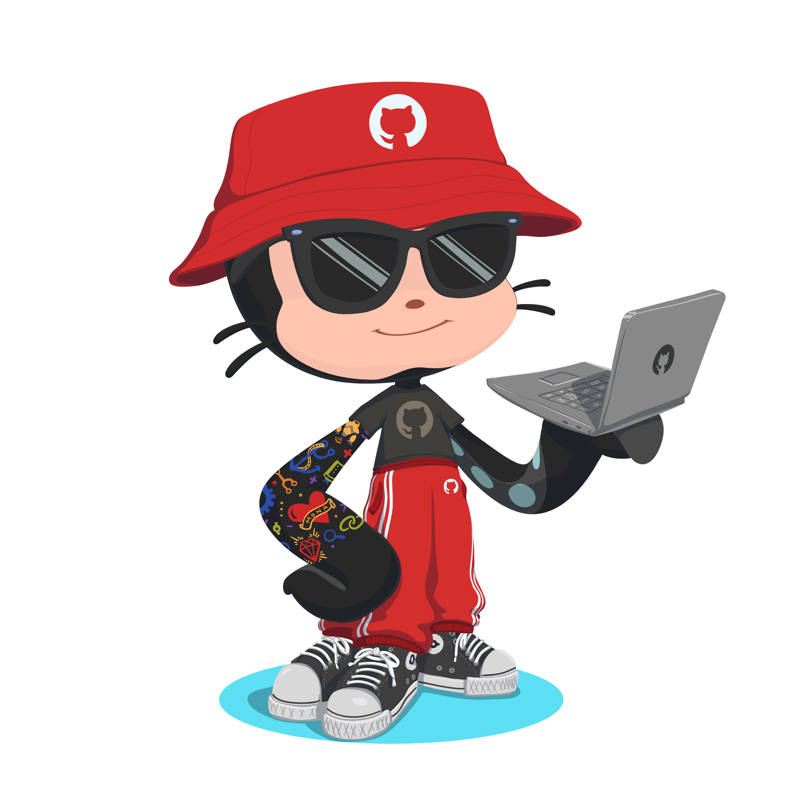
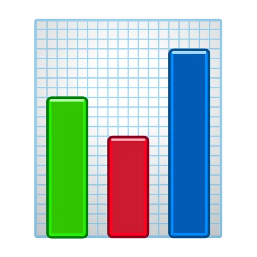

<h1 align='center'>Hi , I'm Maks
  

    ·
    ·
    
  

</h1>

<h2> About Me</h2>

Backend web developer. Most of the time I work with Drupal CMS, as well as with other PHP projects. I'm studying JS and its frameworks and working towards the goal of a full-stack developer. I also have some knowledge of Python. Furthermore, I am interested in AI and workflow automation, and other cool things. I like to study interesting open-source projects and support them whenever possible.

 I'm currently working on something cool 
 I'm looking for help with JS frameworks and Symfony 
 I'm currently learning JS and its frameworks 

<h2> Tech Stack</h2>

<h2> GitHub Stats</h2>

   <a href='#' title='My statistics'>
      <picture>
         <source media='(prefers-color-scheme: dark)' srcset='https://raw.githubusercontent.com/maks-oleksyuk/github-stats/output/overview.svg#gh-dark-mode-only'>
         
      </picture>
      <picture>
         <source media='(prefers-color-scheme: dark)' srcset='https://raw.githubusercontent.com/maks-oleksyuk/github-stats/output/languages.svg#gh-dark-mode-only'>
         
      </picture>
   </a>

<picture>
  <source media='(prefers-color-scheme: dark)' srcset='https://raw.githubusercontent.com/maks-oleksyuk/maks-oleksyuk/output/snake/dark.svg' />
  
</picture>

<!--
<h2> GitHub Achievements</h2>

<picture align='center'>
  <source srcset='https://raw.githubusercontent.com/maks-oleksyuk/maks-oleksyuk/output/metrics/achievements.desktop.svg' media='(min-width: 992px)'>
  <source srcset='https://raw.githubusercontent.com/maks-oleksyuk/maks-oleksyuk/output/metrics/achievements.tablet.svg' media='(min-width: 576px)'>
  
</picture>
-->

  

